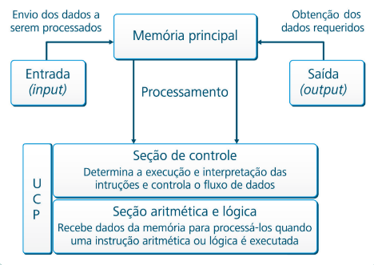

# INTRODUÇÃO AOS COMPONENTES DO COMPUTADOR

Um computador de um modo geral é formado pelo hardware e pelo software. O hardware corresponde à parte física do computador, ou seja, tudo aquilo que podemos tocar, como por exemplo, o gabinete, monitor, teclado, mouse, impressora, entre outros. Já o software corresponde à parte lógica do computador, são os programas, aquilo que não podemos tocar. O software (programas) é aquilo que “dá vida” ao hardware (componentes físicos). 

O hardware do computador constitui-se de elementos básicos chamados de unidades funcionais básicas que são: a unidade central de processamento (UCP), memória principal (RAM) e as unidades de entrada e saída (E/S). A unidade central de processamento, também conhecida como UCP, do inglês Unit Central Processing, constitui o cérebro de um computador. É através do processador que todo o processamento (cálculos e operações) são realizados. 

O processador possui duas seções principais: a ULA (Unidade Lógica e Aritmética) responsável pelos cálculos e operações lógicas e a UC (Unidade de Controle) que controla o fluxo de dados entre memória e processador. Já a memória principal do computador, também chamada de memória RAM, possui como função armazenar a maior quantidade de programas por um tempo determinado. Esta memória denomina-se de volátil, ou seja, todo o seu conteúdo é apagado assim que o computador é desligado ou reinicializado. Os dispositivos de entrada e saída (E/S) tem como função gerenciar os dados que entram e saem do computador. O teclado, por exemplo, é considerado um dispositivo de entrada de dados, pois através dele é possível inserir dados para que possam ser posteriormente processados. Já uma impressora é considerada um dispositivo de saída, pois através dela podemos imprimir algum dado que já foi processado. 

Existem ainda os dispositivos que realizam o papel de dispositivos de entrada e de saída (as duas funções), sendo chamados de dispositivos de entrada e saída, como é o caso de um dispositivo multifuncional (impressão, scanner e copiadora) (VELLOSO, 2004). Na Figura 1, é possível visualizar um resumo quanto ao fluxo das informações dentro de um computador.

